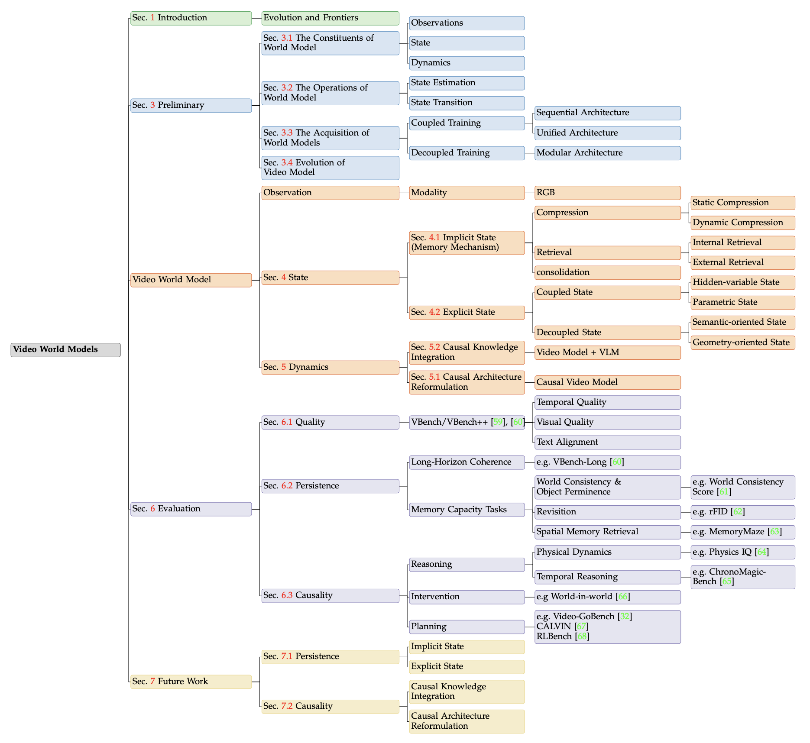
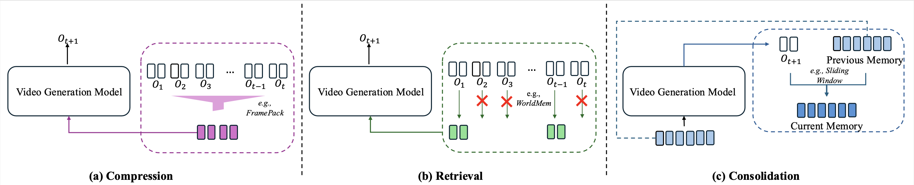
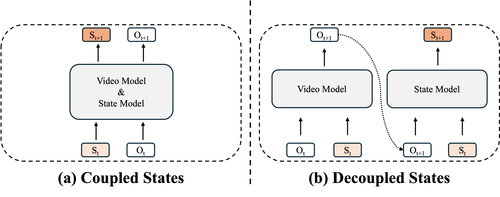

<div align="center">

<!--  -->

# 😎A Mechanistic View on Video Generation as World Models: State and Dynamics😎

[Luozhou Wang](https://wileewang.github.io/)<sup>1*</sup>, [Zhifei Chen](https://zhifeichen097.github.io/)<sup>1*</sup>, [Yihua Du](https://hit-perfect.github.io/)<sup>1</sup>, [Dongyu Yan](https://me.starydy.xyz/)<sup>1</sup>, [Wenhang Ge](https://g3956.github.io/wenhangge.github.io/)<sup>1</sup>, [Guibao Shen](https://dbbpaul.github.io/)<sup>1</sup>, 

[Xinli Xu](https://scholar.google.com.sg/citations?user=lrgPuBUAAAAJ&hl=zh-CN)<sup>1</sup>, [Leyi Wu](https://yuevii.github.io/)<sup>1</sup>, [Man Chen](#)<sup>1</sup>, [Tianshuo Xu](https://scholar.google.com/citations?user=I6_dXvEAAAAJ&hl=zh-CN)<sup>1</sup>, [Peiran Ren](#)<sup>2</sup>, 

[Xin Tao](https://www.xtao.website/)<sup>3</sup>, [Pengfei Wan](https://magicwpf.github.io/)<sup>3</sup>, [Ying-Cong Chen](https://www.yingcong.me/)<sup>1†</sup>

<sup>1</sup>Hong Kong University of Science and Technology (Guangzhou) &nbsp;&nbsp; <sup>2</sup>Tongji University &nbsp;&nbsp; <sup>3</sup>Kling Team, Kuaishou Technology

<sup>*</sup>Equal Contribution &nbsp;&nbsp; <sup>†</sup>Corresponding Author

[](https://github.com/sindresorhus/awesome)
[](https://github.com/hit-perfect/Awesome-Video-World-Models)
[](https://arxiv.org/abs/2601.17067)
[](https://huggingface.co/papers/2601.17067)


</div>

> 💡 **We encourage contributions!** If you come across relevant research that we haven't covered, please open an issue to let us know, and we'll do our best to include it in future updates.

> 🔥 We dedicate a separate section to summarize recent **Video-World-Model** papers every 1-3 days, categorizing them into the paper list below. Community contributions are highly encouraged!

> 👀 If you notice any misclassification of papers, feel free to point it out and we'll correct it!

## 🤩 Overview

Our survey proposes a **State-and-Dynamic-scentric taxonomy** for video generative “world models” (state construction and dynamics modeling) and argues for shifting evaluation from visual realism to functional tests of persistence and causality to advance toward robust, general-purpose simulators.

<p align="center">
   
</p>

We organize the survey into several key sections:

1. <u>Preliminary:</u> formalizes world models and, using open-loop video generation, maps progress in memory and causality toward robust world simulation.
2. <u>State Categorization:</u> Implicit State and Explicit State.
3. <u>Dynamics Categorization:</u> Causal Architecture Reformulation and Causal Knowledge Integration.
4. <u>Evaluation:</u> World-simulation evaluation centers on three axes: Quality, Persistence, and Causality.
5. <u>Future Directions:</u> World simulation is a paradigm shift that hinges on Persistence and Causality.

For more details, please refer to our **[paper](https://arxiv.org/abs/2601.17067)**.

## 📈 Citation

If you find this survey helpful, please cite our work:

```bibtex
@article{wang2026mechanistic,
  title={A Mechanistic View on Video Generation as World Models: State and Dynamics},
  author={Wang, Luozhou and Chen, Zhifei and Du, Yihua and Yan, Dongyu and Ge, Wenhang and Shen, Guibao and Xu, Xinli and Wu, Leyi and Chen, Man and Xu, Tianshuo and others},
  journal={arXiv preprint arXiv:2601.17067},
  year={2026}
}
```

## 🎉 News
- **[2026-01-27]** 🔥 We release [our paper](https://arxiv.org/abs/2601.17067) "A Mechanistic View on Video Generation as World Models: State and Dynamics"!
- **[2026-01-26]** 🔥 We are excited to introduce a comprehensive collection of papers and projects on video generation as world models with a mechanistic view on state and dynamics!

## 📖 Contents
- [A Mechanistic View on Video Generation as World Models: State and Dynamics](#a-mechanistic-view-on-video-generation-as-world-models-state-and-dynamics)
- [🤩 Overview](#-overview)
- [📈 Citation](#-citation)
- [🎉 News](#-news)
- [📖 Contents](#-contents)
- [🔥🔥🔥 Wolrd Model 🔥🔥🔥](#-wolrd-model)
- [📚 Paper List](#-paper-list)
  - [1. State](#1-state)
    - [1.1 Implicit State - Memory Mechanism](#11-implicit-state---memory-mechanism)
      - [Compression](#compression)
        - [Dynamic Compression](#dynamic-compression)
        - [Static Compression](#static-compression)
      - [Retrieval](#retrieval)
        - [External](#external)
        - [Internal](#internal)
      - [Consolidation](#consolidation)
    - [1.2 Explicit State](#12-explicit-state)
      - [Coupled States](#coupled-states)
        - [Hidden-Variable](#hidden-variable)
        - [Parametric](#parametric)
      - [Decoupled States](#decoupled-states)
        - [Semantics-oriented](#semantics-oriented)
        - [Geometry-oriented](#geometry-oriented)
  - [2. Dynamics](#2-dynamics)
    - [2.1 Causal Architecture Reformulation](#21-causal-architecture-reformulation)
    - [2.2 Causal Knowledge Integration](#22-causal-knowledge-integration)
  - [3. Evaluation](#3-evaluation)
    - [3.1 Quality](#31-quality)
    - [3.2 Persistence](#32-persistence)
      - [Long-horizon Coherence](#long-horizon-coherence)
      - [Memory Capacity Tasks](#memory-capacity-tasks)
    - [3.3 Causality](#33-causality)
      - [Temporal Reasoning and Physical Validity](#temporal-reasoning-and-physical-validity)
      - [Interventions and Evaluation](#interventions-and-evaluation)
      - [Planning and Embodied Task Performance](#planning-and-embodied-task-performance)
- [🌟 Acknowledgment](#-acknowledgment)
- [✨ Star History](#-star-history)


## 🔥🔥🔥 Wolrd Model 🔥🔥🔥

> This section highlights representative **World-Model** works. Please feel free to submit PRs to extend the list.

| Date | Name | Title | Paper | Github | Institution |
|:-:|:-:|:-|:-:|:-:|:-:|
| 2025-12 | `HY-World 1.5 (WorldPlay)` | HY-World 1.5: A Systematic Framework for Interactive World Modeling with Real-Time Latency and Geometric Consistency | [](https://3d-models.hunyuan.tencent.com/world/world1_5/HYWorld_1.5_Tech_Report.pdf) | [](https://github.com/Tencent-Hunyuan/HY-WorldPlay) | Tencent Hunyuan |
| 2026-01 | `LingBot-World` | Advancing Open-source World Models | [](https://arxiv.org/abs/2601.20540) | [](https://github.com/robbyant/lingbot-world) | Robbyant Team |
| 2026-01 | `Genie 3` | Genie 3 | - | [](https://deepmind.google/models/genie/) | Google DeepMind |

## 📚 Paper List

> Papers in each section are arranged chronologically by publication date from earliest to latest.

### 1. State

#### 1.1 Implicit State - Memory Mechanism

<p align="center">
   
</p>

##### Compression

###### Dynamic Compression

| Date | Name | Title | Paper | Github |
|:-:|:-:|:-|:-:|:-:|
| 2022-04 | `TokenFusion` | Multimodal Token Fusion for Vision Transformers | [](https://arxiv.org/abs/2204.08721) | [](https://github.com/yikaiw/TokenFusion) |
| 2022-10 | `ToMe` | Token Merging: Your ViT But Faster | [](https://arxiv.org/abs/2210.09461) | [](https://github.com/facebookresearch/ToMe) |
| 2023-05 | `DiffRate` | Diffrate: Differentiable Compression Rate for Efficient Vision Transformers | [](https://arxiv.org/abs/2305.17997) | [](https://github.com/OpenGVLab/DiffRate) |
| 2023-12 | `VidToMe` | VidToMe: Video Token Merging for Zero-Shot Video Editing | [](https://arxiv.org/abs/2312.10656) | [](https://github.com/lixirui142/VidToMe) |
| 2024-03 | `MCTF` | Multi-criteria Token Fusion with One-step-ahead Attention for Efficient Vision Transformers | [](https://arxiv.org/abs/2403.10030) | [](https://github.com/mlvlab/MCTF) |
| 2025 | `AdaptMerge` | AdaptMerge: Inference Time Adaptive Visual and Language-Guided Token Merging for Efficient Large Multimodal Models | [](https://aclanthology.org/2025.findings-emnlp.387.pdf) | - |
| 2025-02 | `SVG` | Sparse VideoGen: Accelerating Video Diffusion Transformers with Spatial-Temporal Sparsity | [](https://arxiv.org/abs/2502.01776) | [](https://github.com/svg-project/Sparse-VideoGen) |
| 2026-02 | `Fast AR Video` | Fast Autoregressive Video Diffusion and World Models with Temporal Cache Compression and Sparse Attention | [](https://arxiv.org/abs/2602.01801) | [](https://dvirsamuel.github.io/fast-auto-regressive-video/) |
| 2026-02 | `Infinite-World` | Infinite-World: Scaling Interactive World Models to 1000-Frame Horizons via Pose-Free Hierarchical Memory | [](https://arxiv.org/abs/2602.02393) | [](https://github.com/MeiGen-AI/Infinite-World) |
| 2026-03 | `WorldCache` | WorldCache: Content-Aware Caching for Accelerated Video World Models | [](https://arxiv.org/abs/2603.22286) | [](https://github.com/umair1221/WorldCache) |

###### Static Compression

| Date | Name | Title | Paper | Github |
|:-:|:-:|:-|:-:|:-:|
| 2023-04 | `Learning to Compress` | Learning to Compress Prompts with Gist Tokens | [](https://arxiv.org/abs/2304.08467) | [](https://github.com/jayelm/gisting) |
| 2024-01 | `Activation Beacon` | Long Context Compression with Activation Beacon | [](https://arxiv.org/abs/2401.03462) | [](https://github.com/FlagOpen/FlagEmbedding) |
| 2024-01 | `RAPTOR` | Raptor: Recursive Abstractive Processing for Tree-Organized Retrieval | [](https://arxiv.org/abs/2401.18059) | [](https://github.com/parthsarthi03/raptor) |
| 2024-10 | `Pyramidal Flow` | Pyramidal Flow Matching for Efficient Video Generative Modeling | [](https://arxiv.org/abs/2410.05954) | [](https://github.com/jy0205/Pyramid-Flow) |
| 2025-04 | `FramePack` | Packing Input Frame Context in Next-Frame Prediction Models for Video Generation | [](https://arxiv.org/abs/2504.12626) | [](https://github.com/lllyasviel/FramePack) |
| 2025-07 | `LoViC` | LoViC: Efficient Long Video Generation with Context Compression | [](https://arxiv.org/abs/2507.12952) | - |
| 2025-11 | `TempoMaster` | TempoMaster: Efficient Long Video Generation via Next-Frame-Rate Prediction | [](https://arxiv.org/abs/2511.12578) | [](https://github.com/scottykma/TempoMaster) |
| 2025-12 | `RELIC` | RELIC: Interactive Video World Model with Long-Horizon Memory | [](https://arxiv.org/abs/2512.04040) | [](https://relic-worldmodel.github.io) |

##### Retrieval

###### External

| Date | Name | Title | Paper | Github |
|:-:|:-:|:-|:-:|:-:|
| 2024 | `Corgi` | Corgi: Cached Memory Guided Video Generation | [](https://openaccess.thecvf.com/content/WACV2025/papers/Wu_Corgi_Cached_Memory_Guided_Video_Generation_WACV_2025_paper.pdf) | - |
| 2025-04 | `RAGME` | RAGME: Retrieval Augmented Video Generation for Enhanced Motion Realism | [](https://arxiv.org/abs/2504.06672) | [](https://github.com/helia95/ragme) |
| 2025-04 | `WorldMem` | WorldMem: Long-term Consistent World Simulation with Memory | [](https://arxiv.org/abs/2504.12369) | [](https://github.com/xizaoqu/WorldMem) |
| 2025-05 | `VRAG` | Learning World Models for Interactive Video Generation | [](https://arxiv.org/abs/2505.21996) | [](https://sites.google.com/view/vrag) |
| 2025-06 | `Context-as-Memory` | Context as Memory: Scene-consistent Interactive Long Video Generation with Memory Retrieval | [](https://arxiv.org/abs/2506.03141) | [](https://context-as-memory.github.io) |
| 2025-09 | `MotionRAG` | MotionRAG: Motion Retrieval-Augmented Image-to-Video Generation | [](https://arxiv.org/abs/2509.26391) | [](https://github.com/MCG-NJU/MotionRAG) |
| 2025-10 | `Ctrl-World` | Ctrl-World: A Controllable Generative World Model for Robot Manipulation | [](https://arxiv.org/abs/2510.10125) | [](https://github.com/Robert-gyj/Ctrl-World) |
| 2025-11 | `MagicWorld` | MagicWorld: Interactive Geometry-driven Video World Exploration | [](https://arxiv.org/abs/2511.18886) | [](https://vivocameraresearch.github.io/magicworld/) |
| 2025-11 | `DiT-Mem` | Learning Plug-and-play Memory for Guiding Video Diffusion Models | [](https://arxiv.org/abs/2511.19229) | [](https://github.com/Thrcle421/DiT-Mem) |
| 2025-12 | `WorldPack` | WorldPack: Compressed Memory Improves Spatial Consistency in Video World Modeling | [](https://arxiv.org/abs/2512.02473) | - | 
| 2025-12 | `OneStory` | OneStory: Coherent Multi-Shot Video Generation with Adaptive Memory | [](https://arxiv.org/abs/2512.07802) | [](https://zhaochongan.github.io/projects/OneStory/) |
| 2026-02 | `AnchorWeave` | AnchorWeave: World-Consistent Video Generation with Retrieved Local Spatial Memories | [](https://arxiv.org/abs/2602.14941) | [](https://github.com/wz0919/AnchorWeave) |
| 2026-03 | `SWM` | Seoul World Model: Grounding World Simulation Models in a Real-World Metropolis | [](https://arxiv.org/abs/2603.15583) | [](https://github.com/naver-ai/seoul-world-model) |
| 2026-03 | `MosaicMem` | MosaicMem: Hybrid Spatial Memory for Controllable Video World Models | [](https://arxiv.org/abs/2603.17117) | [](https://mosaicmem.github.io/mosaicmem/) |

###### Internal

| Date | Name | Title | Paper | Github |
|:-:|:-:|:-|:-:|:-:|
| 2024-12 | `VSA` | Faster Video Diffusion with Trainable Sparse Attention | [](https://arxiv.org/abs/2412.04512) | - |
| 2025-02 | `SVG` | Sparse VideoGen: Accelerating Video Diffusion Transformers with Spatial-Temporal Sparsity | [](https://arxiv.org/abs/2502.01776) | [](https://github.com/svg-project/Sparse-VideoGen) |
| 2025-02 | `MoBA` | MoBA: Mixture of Block Attention for Long-Context LLMs | [](https://arxiv.org/abs/2502.13189) | [](https://github.com/MoonshotAI/MoBA) |
| 2025-02 | `AdaSpa` | Training-free and Adaptive Sparse Attention for Efficient Long Video Generation | [](https://arxiv.org/abs/2502.21079) | - |
| 2025-05 | `SVG2` | Sparse VideoGen2: Accelerate Video Generation with Sparse Attention via Semantic-Aware Permutation | [](https://arxiv.org/abs/2505.18875) | [](https://github.com/svg-project/Sparse-VideoGen) | 
| 2025-06 | `ReSA` | Rectified Sparse Attention | [](https://arxiv.org/abs/2506.04108) | [](https://github.com/microsoft/unilm/tree/master/ReSA) |
| 2025-06 | `Video-XL-2` | Video-XL-2: Towards Very Long-Video Understanding Through Task-Aware KV Sparsification | [](https://arxiv.org/abs/2506.19225) | [](https://github.com/VectorSpaceLab/Video-XL) |
| 2025-06 | `Radial Attention` | Radial Attention: Sparse Attention with Energy Decay for Long Video Generation | [](https://arxiv.org/abs/2506.19852) | [](https://github.com/mit-han-lab/radial-attention) |
| 2025-06 | `VMOBA` | VMoBA: Mixture-of-Block Attention for Video Diffusion Models | [](https://arxiv.org/abs/2506.23858) | [](https://github.com/KlingTeam/VMoBA) |
| 2025-08 | `MoC` | Mixture of Contexts for Long Video Generation | [](https://arxiv.org/abs/2508.21058) | [](https://primecai.github.io/moc/) |
| 2025-09 | `BSA` | Bidirectional Sparse Attention for Faster Video Diffusion Training | [](https://arxiv.org/abs/2509.01085) | - |
| 2025-10 | `MoGA` | MoGA: Mixture-of-Groups Attention for End-to-End Long Video Generation | [](https://arxiv.org/abs/2510.18692) | [](https://github.com/bytedance-fanqie-ai/MoGA) |
| 2026-03 | `SVG-EAR` | Sparse VideoGen with Error-Aware Routing Compensation | [](https://arxiv.org/abs/2603.08982) | - | 

##### Consolidation

| Date | Name | Title | Paper | Github |
|:-:|:-:|:-|:-:|:-:|
| 2024-03 | `StreamingT2V` | StreamingT2V: Consistent, Dynamic, and Extendable Long Video Generation from Text | [](https://arxiv.org/abs/2403.14773) | [](https://github.com/Picsart-AI-Research/StreamingT2V) |
| 2024-07 | `FreeLong` | FreeLong: Training-free Long Video Generation with SpectralBlend Temporal Attention | [](https://arxiv.org/abs/2407.19918) | [](https://github.com/aniki-ly/FreeLong) |
| 2024-10 | `Loong` | Loong: Generating Minute-level Long Videos with Autoregressive Language Models | [](https://arxiv.org/abs/2410.02757) | [](https://yuqingwang1029.github.io/Loong-video/) |
| 2025-03 | `FAR` | Long-context Autoregressive Video Modeling with Next-frame Prediction | [](https://arxiv.org/abs/2503.19325) | [](https://github.com/showlab/FAR) |
| 2025-08 | `WorldWeaver` | WorldWeaver: Generating Long-horizon Video Worlds via Rich Perception | [](https://arxiv.org/abs/2508.15720) | [](https://johanan528.github.io/worldweaver_web/) |
| 2025-12 | `EgoLCD` | EgoLCD: Egocentric Video Generation with Long Context Diffusion | [](https://arxiv.org/abs/2512.04515) | [](https://aigeeksgroup.github.io/EgoLCD/) |
| 2026-03 | `Anchor Forcing` | Anchor Forcing: Streamable Interactive Video Diffusion with Anchor Memory and Three-Region RoPE | [](https://arxiv.org/abs/2603.13405) | [](https://github.com/vivoCameraResearch/Anchor-Forcing) |

#### 1.2 Explicit State

<p align="center">
   
</p>

##### Coupled States

###### Hidden-Variable

| Date | Name | Title | Paper | Github |
|:-:|:-:|:-|:-:|:-:|
| 2024-05 | `Matten` | Matten: Video Generation with Mamba-Attention | [](https://arxiv.org/abs/2405.03025) | - |
| 2024-05 | `DiM` | Scaling Diffusion Mamba with Bidirectional SSMs for Efficient Image and Video Generation | [](https://arxiv.org/abs/2405.15881) | - |
| 2024-09 | `LinGen` | LinGen: Towards High-Resolution Minute-Length Text-to-Video Generation with Linear Computational Complexity | [](https://arxiv.org/abs/2409.09396) | - |
| 2025-02 | `MALT Diffusion` | MALT Diffusion: Memory-Augmented Latent Transformers for Any-Length Video Generation | [](https://arxiv.org/abs/2502.12632) | - |
| 2025-05 | `LcSs` | Long-context State-space Video World Models | [](https://arxiv.org/abs/2505.20171) | [](https://ryanpo.com/ssm_wm/) |
| 2025-09 | `SANA-Video` | SANA-Video: Efficient Video Generation with Block Linear Diffusion Transformer | [](https://arxiv.org/abs/2509.24695) | [](https://github.com/NVlabs/Sana) |
| 2025-11 | `RAD` | Recurrent Autoregressive Diffusion: Global Memory Meets Local Attention | [](https://arxiv.org/abs/2511.12940) | - |
| 2025-12 | `VideoSSM` | VideoSSM: Autoregressive Long Video Generation with Hybrid State-Space Memory | [](https://arxiv.org/abs/2512.04519) | - |

###### Parametric

| Date | Name | Title | Paper | Github |
|:-:|:-:|:-|:-:|:-:|
| 2025-01 | `Titans` | Titans: Learning to Memorize at Test Time | [](https://arxiv.org/abs/2501.00663) | - |
| 2025-04 | `TTT-DiT` | One-minute Video Generation with Test-time Training | [](https://arxiv.org/abs/2504.05298) | [](https://github.com/test-time-training/ttt-video-dit) |
| 2025-12 | `Nested Learning` | Nested Learning: The Illusion of Deep Learning Architectures | [](https://arxiv.org/abs/2512.24695) | [](https://research.google/blog/introducing-nested-learning-a-new-ml-paradigm-for-continual-learning/) |

##### Decoupled States

###### Semantics-oriented

| Date | Name | Title | Paper | Github |
|:-:|:-:|:-|:-:|:-:|
| 2024-12 | `Owl-1` | Owl-1: Omni World Model for Consistent Long Video Generation | [](https://arxiv.org/abs/2412.09600) | [](https://github.com/huang-yh/Owl) |
| 2025-10 | `Pack and Force` | Pack and Force Your Memory: Long-form and Consistent Video Generation | [](https://arxiv.org/abs/2510.01784) | [](https://wuxiaofei01.github.io/PFVG/) |
| 2026-02 | `ConsisDrive` | ConsisDrive: Identity-Preserving Driving World Models for Video Generation by Instance Mask | [](https://arxiv.org/abs/2602.03213) | - |

###### Geometry-oriented

| Date | Name | Title | Paper | Github |
|:-:|:-:|:-|:-:|:-:|
| 2024-09 | `ViewCrafter` | ViewCrafter: Taming Video Diffusion Models for High-fidelity Novel View Synthesis | [](https://arxiv.org/abs/2409.02048) | [](https://github.com/Drexubery/ViewCrafter) |
| 2025-01 | `StarGen` | StarGen: A Spatiotemporal Autoregression Framework with Video Diffusion Model for Scalable and Controllable Scene Generation | [](https://arxiv.org/abs/2501.05763) | [](https://github.com/zju3dv/StarGen) |
| 2025-03 | `Gen3C` | Gen3C: 3D-Informed World-Consistent Video Generation with Precise Camera Control | [](https://arxiv.org/abs/2503.03751) | [](https://github.com/nv-tlabs/GEN3C) |
| 2025-03 | `FlexWorld` | FlexWorld: Progressively Expanding 3D Scenes for Flexible-view Synthesis | [](https://arxiv.org/abs/2503.13265) | [](https://github.com/ML-GSAI/FlexWorld) |
| 2025-03 | `GenFusion` | GenFusion: Closing the Loop Between Reconstruction and Generation via Videos | [](https://arxiv.org/abs/2503.21219) | [](https://github.com/Inception3D/GenFusion) |
| 2025-04 | `Scene Splatter` | Scene Splatter: Momentum 3D Scene Generation from Single Image with Video Diffusion Model | [](https://arxiv.org/abs/2504.02764) | [](https://github.com/shengjun-zhang/Scene-Splatter) |
| 2025-04 | `Uni3C` | Uni3C: Unifying Precisely 3D-Enhanced Camera and Human Motion Controls for Video Generation | [](https://arxiv.org/abs/2504.14899) | [](https://github.com/alibaba-damo-academy/Uni3C) |
| 2025-06 | `Voyager` | Voyager: Long-Range and World-Consistent Video Diffusion for Explorable 3D Scene Generation | [](https://arxiv.org/abs/2506.04225) | [](https://github.com/Tencent-Hunyuan/HunyuanWorld-Voyager) |
| 2025-06 | `VMem` | VMem: Consistent Interactive Video Scene Generation with Surfel-Indexed View Memory | [](https://arxiv.org/abs/2506.18903) | [](https://github.com/runjiali-rl/vmem) |
| 2025-08 | `Matrix-3D` | Matrix-3D: Omnidirectional Explorable 3D World Generation | [](https://arxiv.org/abs/2508.08086) | [](https://github.com/SkyworkAI/Matrix-3D) |
| 2025-10 | `EvoWorld` | EvoWorld: Evolving Panoramic World Generation with Explicit 3D Memory | [](https://arxiv.org/abs/2510.01183) | [](https://github.com/JiahaoPlus/EvoWorld) |
| 2026-02 | `GeoRoPE` | Geometry-Aware Rotary Position Embedding for Consistent Video World Model | [](https://arxiv.org/abs/2602.07854) | - |
| 2026-03 | `X-World` | X-World: Controllable Ego-Centric Multi-Camera World Models for Scalable End-to-End Driving | [](https://arxiv.org/abs/2603.19979) | - |


### 2. Dynamics

#### 2.1 Causal Architecture Reformulation

| Date | Name | Title | Paper | Github |
|:-:|:-:|:-|:-:|:-:|
| 2023-11 | `ART-V` | ART-V: Auto-regressive Text-to-Video Generation with Diffusion Models | [](https://arxiv.org/abs/2311.18834) | - |
| 2023-12 | `VideoPoet` | VideoPoet: A Large Language Model for Zero-Shot Video Generation | [](https://arxiv.org/abs/2312.14125) | [](https://sites.research.google/videopoet/) |
| 2024-07 | `Diffusion Forcing` | Diffusion Forcing: Next-token Prediction Meets Full-Sequence Diffusion | [](https://arxiv.org/abs/2407.01392) | [](https://github.com/buoyancy99/diffusion-forcing) |
| 2024-12 | `CausVid` | From Slow Bidirectional to Fast Autoregressive Video Diffusion Models | [](https://arxiv.org/abs/2412.07772) | [](https://github.com/tianweiy/CausVid) |
| 2024-12 | `NOVA` | Autoregressive Video Generation without Vector Quantization | [](https://arxiv.org/abs/2412.14169) | [](https://github.com/baaivision/NOVA) |
| 2025-03 | `AR-Diffusion` | AR-Diffusion: Asynchronous Video Generation with Auto-Regressive Diffusion | [](https://arxiv.org/abs/2503.07418) | [](https://github.com/iva-mzsun/AR-Diffusion) |
| 2025-03 | `FAR` | Long-context Autoregressive Video Modeling with Next-frame Prediction | [](https://arxiv.org/abs/2503.19325) | [](https://github.com/showlab/FAR) |
| 2025-05 | `MAGI-1` | MAGI-1: Autoregressive Video Generation at Scale | [](https://arxiv.org/abs/2505.13211) | [](https://github.com/SandAI-org/MAGI-1) |
| 2025-05 | `Video-GPT` | Video-GPT via Next Clip Diffusion | [](https://arxiv.org/abs/2505.12489) | [](https://github.com/zhuangshaobin/Video-GPT) |
| 2025-06 | `VideoMAR` | VideoMAR: Autoregressive Video Generation with Continuous Tokens | [](https://arxiv.org/abs/2506.14168) | [](https://yuhuustc.github.io/projects/VideoMAR.html) |
| 2025-06 | `Self-Forcing` | Self Forcing: Bridging the Train-Test Gap in Autoregressive Video Diffusion | [](https://arxiv.org/abs/2506.08009) | [](https://github.com/guandeh17/Self-Forcing) |
| 2025-07 | `Lumos-1` | Lumos-1: On Autoregressive Video Generation from a Unified Model Perspective | [](https://arxiv.org/abs/2507.08801) | [](https://github.com/alibaba-damo-academy/Lumos) |
| 2025-09 | `LongLive` | LongLive: Real-time Interactive Long Video Generation | [](https://arxiv.org/abs/2509.22622) | [](https://github.com/NVlabs/LongLive) |
| 2025-09 | `Rolling Forcing` | Rolling Forcing: Autoregressive Long Video Diffusion in Real Time | [](https://arxiv.org/abs/2509.25161) | [](https://github.com/TencentARC/RollingForcing) |
| 2025-10 | `Self-Forcing++` | Self-Forcing++: Towards Minute-Scale High-Quality Video Generation | [](https://arxiv.org/abs/2510.02283) | [](https://github.com/justincui03/Self-Forcing-Plus-Plus) |
| 2025-12 | `Resampling Forcing` | End-to-End Training for Autoregressive Video Diffusion via Self-Resampling | [](https://arxiv.org/abs/2512.15702) | [](https://guoyww.github.io/projects/resampling-forcing/) |
| 2026-02 | `Causal Forcing` | Autoregressive Diffusion Distillation Done Right for High-Quality Real-Time Interactive Video Generation | [](https://arxiv.org/abs/2602.02214) | [](https://github.com/thu-ml/Causal-Forcing) |
| 2026-02 | `LIVE` | LIVE: Long-horizon Interactive Video World Modeling | [](https://arxiv.org/abs/2602.03747) | [](https://junchao-cs.github.io/LIVE-demo/) |
| 2026-02 | `DriveWorld-VLA` | DriveWorld-VLA: Unified Latent-Space World Modeling with Vision-Language-Action for Autonomous Driving | [](https://arxiv.org/abs/2602.06521) | [](https://github.com/liulin815/DriveWorld-VLA) |
| 2026-02 | `Hand2World` | Hand2World: Autoregressive Egocentric Interaction Generation via Free-Space Hand Gestures | [](https://arxiv.org/abs/2602.09600) | [](https://hand2world.github.io/) |
| 2026-03 | `CubeComposer` | CubeComposer: Spatiotemporal Autoregressive 4K 360° Video Generation | [](https://arxiv.org/abs/2603.04291) | [](https://lg-li.github.io/project/cubecomposer/) |
| 2026-03 | `Helios` | Helios: Real Real-Time Long Video Generation Model | [](https://arxiv.org/abs/2603.04379) | [](https://pku-yuangroup.github.io/Helios-Page/) |
| 2026-03 | `HiAR` | HiAR: Hierarchical Autoregressive Video Generation with Denoising Stages | [](https://arxiv.org/abs/2603.08703) | [](https://github.com/Jacky-hate/HiAR) |
| 2026-03 | `Diagonal Distillation` | Streaming Autoregressive Video Generation via Diagonal Distillation | [](https://arxiv.org/abs/2603.09488) | [](https://github.com/Sphere-AI-Lab/diagdistill) |


#### 2.2 Causal Knowledge Integration

| Date | Name | Title | Paper | Github |
|:-:|:-:|:-|:-:|:-:|
| 2023-09 | `VIDEODIRECTORGPT` | VideoDirectorGPT: Consistent Multi-scene Video Generation via LLM-guided Planning | [](https://arxiv.org/abs/2309.15091) | [](https://github.com/HL-hanlin/VideoDirectorGPT) |
| 2023-09 | `LVD` | LLM-grounded Video Diffusion Models | [](https://arxiv.org/abs/2309.17444) | [](https://github.com/TonyLianLong/LLM-groundedVideoDiffusion) |
| 2024-12 | `Owl-1` | Owl-1: Omni World Model for Consistent Long Video Generation | [](https://arxiv.org/abs/2412.09600) | [](https://github.com/huang-yh/Owl) |
| 2024-12 | `DirectorLLM` | Llama Learns to Direct: DirectorLLM for Human-Centric Video Generation | [](https://arxiv.org/abs/2412.14484) | - |
| 2025-03 | `VLIPP` | VLIPP: Towards Physically Plausible Video Generation with Vision and Language Informed Physical Prior | [](https://arxiv.org/abs/2503.23368) | [](https://github.com/Madaoer/VLIPP) |
| 2025-05 | `BAGEL` | Emerging Properties in Unified Multimodal Pretraining | [](https://arxiv.org/abs/2505.14683) | [](https://github.com/bytedance-seed/BAGEL) |
| 2025-06 | `CSVC` | Causally Steered Diffusion for Automated Video Counterfactual Generation | [](https://arxiv.org/abs/2506.14404) | [](https://github.com/nysp78/counterfactual-video-generation) |
| 2025-10 | `UniVideo` | UniVideo: Unified Understanding, Generation, and Editing for Videos | [](https://arxiv.org/abs/2510.08377) | [](https://github.com/KlingTeam/UniVideo) |
| 2025-12 | `SemanticGen` | SemanticGen: Video Generation in Semantic Space | [](https://arxiv.org/abs/2512.20619) | [](https://jianhongbai.github.io/SemanticGen/) |
| 2026-02 | `WorldCompass` | WorldCompass: Reinforcement Learning for Long-Horizon World Models | [](https://arxiv.org/abs/2602.09022) | [](https://3d-models.hunyuan.tencent.com/world/) |
| 2026-02 | `DreamWorld` | DreamWorld: Unified World Modeling in Video Generation | [](https://arxiv.org/abs/2603.00466) | [](https://github.com/ABU121111/DreamWorld) |
| 2026-03 | `Physical Simulator In-the-Loop` | Physical Simulator In-the-Loop Video Generation | [](https://arxiv.org/abs/2603.06408) | [](https://github.com/MarkHershey/PSIVG) |
| 2026-03 | `SPIRAL` | SPIRAL: A Closed-Loop Framework for Self-Improving Action World Models via Reflective Planning Agents | [](https://arxiv.org/abs/2603.08403) | - |
| 2026-03 | `Chain of Causal Thought` | Chain of Causal Thought for Physically Plausible Video Generation | [](https://arxiv.org/abs/2603.09094) | - |
| 2026-03 | `EVA` | EVA: Aligning Video World Models with Executable Robot Actions via Inverse Dynamics Rewards | [](https://arxiv.org/abs/2603.17808) | [](https://github.com/RobbinW/EVA) |
| 2026-03 | `ThinkJEPA` | ThinkJEPA: Empowering Latent World Models with Large Vision-Language Reasoning Model | [](https://arxiv.org/abs/2603.22281) | - |


### 3. Evaluation

#### 3.1 Quality

| Date | Name | Title | Paper | Github |
|:-:|:-:|:-|:-:|:-:|
| 2017-06 | `FID` | GANs Trained by a Two Time-Scale Update Rule Converge to a Local Nash Equilibrium | [](https://arxiv.org/abs/1706.08500) | [](https://github.com/bioinf-jku/TTUR) |
| 2018-12 | `FVD` | Towards Accurate Generative Models of Video: A New Metric & Challenges | [](https://arxiv.org/abs/1812.01717) | [](https://github.com/google-research/google-research/tree/master/frechet_video_distance) |
| 2023-11 | `VBench` | VBench: Comprehensive Benchmark Suite for Video Generative Models | [](https://arxiv.org/abs/2311.17982) | [](https://github.com/Vchitect/VBench) |
| 2024-07 | `FVMD` | Fréchet Video Motion Distance: A Metric for Evaluating Motion Consistency in Videos | [](https://arxiv.org/abs/2407.16124) | [](https://github.com/DSL-Lab/FVMD-frechet-video-motion-distance) |
| 2024-11 | `VBench++` | VBench++: Comprehensive and Versatile Benchmark Suite for Video Generative Models | [](https://arxiv.org/abs/2411.13503) | [](https://github.com/Vchitect/VBench) |
| 2025-02 | `WorldModelBench` | WorldModelBench: Judging Video Generation Models as World Models | [](https://arxiv.org/abs/2502.20694) | [](https://github.com/WorldModelBench-Team/WorldModelBench/tree/main?tab=readme-ov-file#evaluation) |

#### 3.2 Persistence

##### Long-horizon Coherence

| Date | Name | Title | Paper | Github |
|:-:|:-:|:-|:-:|:-:|
| 2024-11 | `VBench++` | VBench++: Comprehensive and Versatile Benchmark Suite for Video Generative Models | [](https://arxiv.org/abs/2411.13503) | [](https://github.com/Vchitect/VBench) |
| 2026-02 | `MSVBench` | MSVBench: Towards Human-Level Evaluation of Multi-Shot Video Generation | [](https://arxiv.org/abs/2602.23969) | - |

##### Memory Capacity Tasks

| Date | Name | Title | Paper | Github |
|:-:|:-:|:-|:-:|:-:|
| 2022-10 | `Memory Maze` | Evaluating Long-Term Memory in 3D Mazes | [](https://arxiv.org/abs/2210.13383) | [](https://github.com/jurgisp/memory-maze) |
| 2025-08 | `World Consistency Score` | World Consistency Score: A Unified Metric for Video Generation Quality | [](https://arxiv.org/abs/2508.00144) | - |
| 2025-11 | `VR-Bench` | Reasoning via Video: The First Evaluation of Video Models' Reasoning Abilities through Maze-Solving Tasks | [](https://arxiv.org/abs/2511.15065) | [](https://github.com/FoundationAgents/VR-Bench) |
| 2026-02 | `MIND` | MIND: Benchmarking Memory Consistency and Action Control in World Models | [](https://arxiv.org/abs/2602.08025) | [](https://github.com/CSU-JPG/MIND) |
| 2026-03 | `LiveWorld` | LiveWorld: Simulating Out-of-Sight Dynamics in Generative Video World Models | [](https://arxiv.org/abs/2603.07145) | [](https://zichengduan.github.io/LiveWorld/index.html) |
| 2026-03 | `STEVO-Bench` | STEVO-Bench: Out of Sight, Out of Mind? Evaluating State Evolution in Video World Models | [](https://arxiv.org/abs/2603.13215) | - |

#### 3.3 Causality

##### Temporal Reasoning and Physical Validity

| Date | Name | Title | Paper | Github |
|:-:|:-:|:-|:-:|:-:|
| 2024-06 | `ChronoMagic-Bench` | ChronoMagic-Bench: A Benchmark for Metamorphic Evaluation of Text-to-Time-lapse Video Generation | [](https://arxiv.org/abs/2406.18522) | [](https://github.com/PKU-YuanGroup/ChronoMagic-Bench) |
| 2025-01 | `Physics-IQ` | Do Generative Video Models Understand Physical Principles? | [](https://arxiv.org/abs/2501.09038) | [](https://github.com/google-deepmind/physics-IQ-benchmark) |
| 2026-02 | `Interpreting Physics` | Interpreting Physics in Video World Models | [](https://arxiv.org/abs/2602.07050) | - |
| 2026-03 | `OSCBench` | OSCBench: Object State Change Benchmark for Text-to-Video Generation | [](https://arxiv.org/abs/2603.11698) | [](https://hanxjing.github.io/OSCBench/) |
| 2026-03 | `MME-CoF-Pro` | MME-CoF-Pro: Evaluating Reasoning Coherence in Video Generative Models with Text and Visual Hints | [](https://arxiv.org/abs/2603.20194) | [](https://github.com/yqi19/MME-CoF-Pro) |

##### Interventions and Evaluation

| Date | Name | Title | Paper | Github |
|:-:|:-:|:-|:-:|:-:|
| 2025-10 | `World-in-World` | World-in-World: World Models in a Closed-Loop World | [](https://arxiv.org/abs/2510.18135) | [](https://github.com/World-In-World/world-in-world) |
| 2026-03 | `Omni-WorldBench` | Omni-WorldBench: Towards a Comprehensive Interaction-Centric Evaluation for World Models | [](https://arxiv.org/abs/2603.22212) | [](https://github.com/AMAP-ML/Omni-WorldBench) |

##### Planning and Embodied Task Performance

| Date | Name | Title | Paper | Github |
|:-:|:-:|:-|:-:|:-:|
| 2019-09 | `RLBench` | RLBench: The Robot Learning Benchmark & Learning Environment | [](https://arxiv.org/abs/1909.12271) | [](https://github.com/stepjam/RLBench) |
| 2021-12 | `CALVIN` | CALVIN: A Benchmark for Language-Conditioned Policy Learning for Long-Horizon Robot Manipulation Tasks | [](https://arxiv.org/abs/2112.03227) | [](https://github.com/mees/calvin) |
| 2025-01 | `VideoWorld` | VideoWorld: Exploring Knowledge Learning from Unlabeled Videos | [](https://arxiv.org/abs/2501.09781) | [](https://github.com/ByteDance-Seed/VideoWorld) |
| 2026-02 | `WorldArena` | WorldArena: A Unified Benchmark for Evaluating Perception and Functional Utility of Embodied World Models | [](https://arxiv.org/abs/2602.08971) | [](https://world-arena.ai/) |
| 2026-03 | `PlayWorld` | PlayWorld: Learning Robot World Models from Autonomous Exploration | [](https://arxiv.org/abs/2603.09030) | [](https://robot-playworld.github.io/) |


## 🌟 Acknowledgment

We would like to express our sincere gratitude to the [Awesome-RL-for-LRMs](https://github.com/TsinghuaC3I/Awesome-RL-for-LRMs) repository for providing an excellent README template that inspired the structure and organization of this collection. Their well-designed format has been instrumental in helping us present our survey in a clear and accessible manner.

## ✨ Star History

[](https://www.star-history.com/#hit-perfect/Awesome-Video-World-Models&Date)
